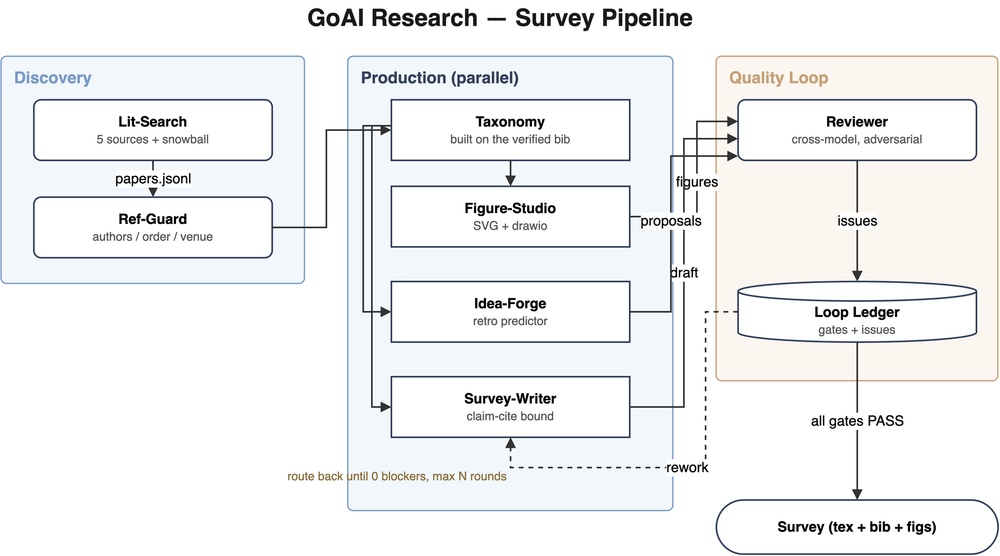
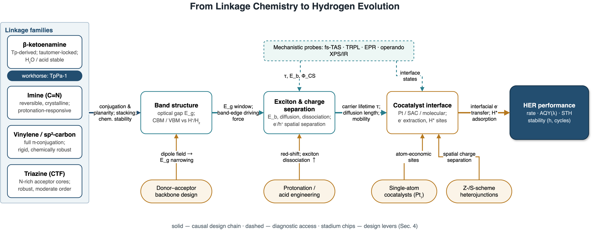
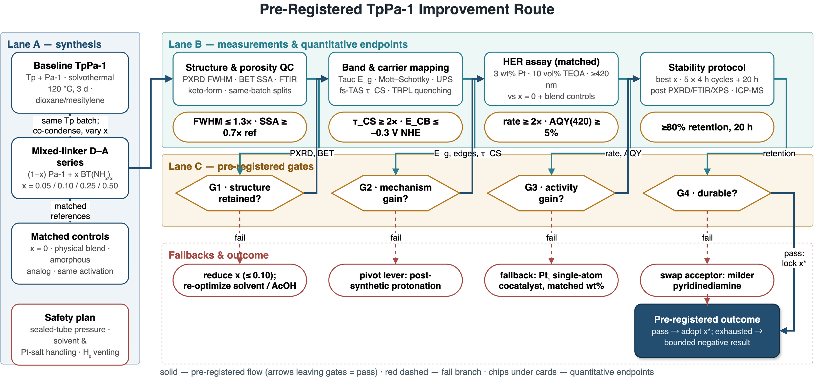

<div align="center">

# GoAI Research 📚⚔️

**多智能体流水线：一个研究主题进去，一篇引用可信、图纸可编辑的综述论文出来。**

[](LICENSE)
[](pyproject.toml)
[](tests/)
[](server/)
[](skills/)

中文版 README | [English](README.md)

</div>

> 🔍 **检索求全，引用零信任，图纸永远可编辑。**
> 五源文献检索 + 引文滚雪球；逐条核验的引用闸门；一份图纸源文件同时渲染出
> 论文 SVG 和 draw.io 原生可编辑文件；idea 生成可接逆合成预测器——全部接进一个
> 账本驱动的回环，由对抗审稿人把返工路由到对应阶段，直到所有闸门通过。

> 🪶 **轻量设计，零锁定。** 智能层是 9 个纯 Markdown skill，任何 LLM agent
> 都能读——Codex CLI、Claude Code、Cursor 或你自己的 harness；确定性层是 4 个
> 可离线测试的小 MCP server。没有框架、没有数据库、没有守护进程。随便 fork、改写、适配你的技术栈。

## 🏁 GOAI 2026 复赛提交（AI for Research · 材料方向）

评审入口：[`docs/competition/SUBMISSION.md`](docs/competition/SUBMISSION.md) —— 六项交付物位置、模型与 Harness 声明
（Codex CLI 0.146.1 · gpt-5.6-sol · reasoning xhigh）、7 组运行记录与正式结果的筛选规则、数据许可边界、
指标复核、一条结论的完整追溯链。正式提交包在 [`submission/goai_final/`](submission/goai_final/README.md)：
23 页正式报告 + LaTeX 源、复赛报告 DOCX、方案说明 PPT、`claim_evidence.jsonl`（100 条结论 → 219 次引用 → 51 个核验键）、
被引文献全文精简知识库（`goai-compact-parquet-v1`）、40 个子任务的 Codex 事件流、构筑阶段原生 rollout、
RECIPE 两阶段模型 checkpoint 及其评测汇总。

```bash
bash install.sh --retro                    # 安装（.venv + 依赖 + MCP 配置）
bash scripts/smoke_test.sh --with-retro    # 冒烟：无网络、无 LLM，1–2 分钟，末行 SMOKE TEST PASSED
.venv/bin/python tools/retro_dry_run.py       # 前驱体模型 dry run：校验 checkpoint 并在 CPU 上预测
bash scripts/reproduce_core.sh             # 核心复现：一行主题 → 综述 PDF（需 Codex 登录、网络、TeX）
bash scripts/package_submission.sh "<队伍名>"   # 生成官方命名的两个 zip
```

## 📰 动态

- **2026-09-03 —— 复赛提交包。** `submission/goai_final/` 汇齐六项交付物；新增
  `tools/retro_dry_run.py`（最小加载 + 预测 dry run；逆合成部分只交 checkpoint、最小推理代码与原料库，
  指标以随 checkpoint 提交的评测汇总为准）、`tools/build_cited_corpus.py`
  （仅导出被引文献全文为精简 Parquet）、`tools/build_claim_evidence.py`（结论—证据映射）、
  `tools/export_submission_bundle.py`（运行/构筑轨迹受控导出 + 密钥脱敏）、`tools/build_report_docx.py`
  （官方模板灌装）、`scripts/smoke_test.sh` / `scripts/reproduce_core.sh` / `scripts/package_submission.sh`。
- **2026-09-02 —— 美感成为闸门，文字度量变得诚实。** 图纸 lint 新增第二层，
  把审稿人说的「有点乱」变成可测量指标：色系数（≤2 主题色 + 1 强调色，≥4 直接
  error）、彩虹泳道、近失对齐、兄弟尺寸漂移、间距过密、连线穿节点、交叉数、
  描边档数、标题层级、边标签压在自己的端点上。底层三方（SVG、draw.io、lint）
  改为共用一套按词折行、按 Helvetica 真实字宽（含粗体系数）计算的算法——
  过去均一 0.61em 的估算让大写密集的粗体芯片在 draw.io 里溢出，而 lint 还说
  「放得下」；draw.io 输出改带显式 `<br/>`，渲染的行与 lint 度量的完全一致。
  样例图重排到零告警。离线测试 54 项。
- **2026-09-02 —— 独立审计补上两个回环协议漏洞。** 对照最初需求做的只读
  审计发现：`check-done` 只记一个 gate 就能宣告 DONE（恰是停在文献检索的
  那种账本形态），`review_pass` 无回执也能记 PASS。现已机械化：9 个必需
  gate 必须全部落账（跳过要显式 WARN，自造 gate 名会被警告），审稿 PASS
  的 trace 文件不存在或为占位即拒绝。同时修复 vendored 模型一处缩进错误
  ——无机前驱体预测器此前根本 import 不了，现在 `BaZn2Si2O7 → ZnO / SiO₂ /
  BaCO₃` 本机端到端可跑。离线测试 48 项。
- **2026-08-31 —— 学术内容契约。** 材料领域专家对综述的反馈固化为 skill
  级规则：每篇综述必配**行文路线图**；材料主题强制两条检索面（近邻/同型
  体系、相图）并在引言单独成节讲近邻体系发现；结果部分先给前人实验结论
  合集；每个新方向必须落到具体合成建议——工艺路线名 + 来自 retro MCP 的
  前驱体候选（标注「模型预测，待实验验证」）；结论以「最有科学发现价值的
  下一步实验」收尾。图纸：全图 ≤2 主题色，所有交付图走 image-first 参照生成。
- **2026-08-30 —— 排版硬闸门 v2。** 节点主标**默认加粗**，字号地板提高到
  4.5 pt 打印等效，新增层级 lint（组标签小于成员节点主标即告警）。写作 skill
  新增节标题词法规范（名词短语、禁「A、B 与 C」式三段并列标题）与顶会级
  行内列表排版规则。
- **2026-08-29 —— 首个公开样例交付物。** COF 光催化产氢综述，端到端实跑
  26 页：[`examples/survey_cof_her`](examples/survey_cof_her) —— 143 篇验证
  文献（整合率 100%、密度 51.2 次/千词）、通过排版 lint 的可编辑图、
  一条预注册改进 idea、全闸门账本。
- **2026-08-28 —— 规模档 + 风格库。** 文献检索新增 standard / comprehensive /
  exhaustive 三档分层配额（完整综述 100+ 文献）；从 30 篇经典综述蒸馏出
  风格库；接入 [super_library](https://github.com/asimfish/super_library)
  作为写作语言权威。
- **2026-08-28 —— 排版 lint v1。** 打印等效字号地板、形状感知的文字溢出
  检测、遮挡检查；lint 有错时 `render_figure` 拒绝渲染。
- **2026-08-27 —— 首次完整竞赛实跑。** 37 篇文献综述 + 合成路线设计，
  9 个闸门 PASS，两轮对抗审稿并逐项销号
  （[`examples/competition_run`](examples/competition_run)）。
- **2026-08-26 —— 回环上线。** 账本驱动状态机（`loopctl`）、带回执的对抗
  审稿人、基于指纹的过期闸门检测。

</details>

## 🖼 效果预览



*这张图就是系统自己画的：一份 [`figspec`](examples/pipeline.figspec.json) 源文件，
同时渲染出 [`pipeline.svg`](examples/pipeline.svg)（论文用）、
[`pipeline.drawio`](examples/pipeline.drawio)（draw.io 打开直接继续编辑）
和上面的 PNG（自检用）。*

**来自真实实跑** —— 下面两张图都出自
[26 页样例综述](examples/survey_cof_her/paper/main.pdf)，且全部保持可编辑
（figspec → SVG → .drawio）：

| [设计杠杆因果链](examples/survey_cof_her/paper/figures/fig1_factor_chain.png) | [预注册改进路线](examples/survey_cof_her/paper/figures/fig2_tppa1_idea.png) |
| --- | --- |
|  |  |
| 主标默认加粗 · 4.5 pt 地板 lint 全绿 | 闸门、回退与终点——一张可编辑画布 |

## 目录

1. [不只是一段提示词](#1--不只是一段提示词)
2. [快速开始](#2--快速开始)
3. [内部构成](#3--内部构成)
4. [回环机制](#4--回环机制)
5. [永远可编辑的图纸](#5--永远可编辑的图纸)
6. [引用完整性](#6--引用完整性)
7. [Idea 锻造与逆合成](#7--idea-锻造与逆合成)
8. [并行执行](#8--并行执行)
9. [宿主接入](#9--宿主接入) · Codex / Claude Code / Cursor
10. [配置](#10--配置)
11. [测试](#11--测试)
12. [设计笔记](#12--设计笔记) · 为什么 MCP+skill、为什么跨模型审稿
13. [常见问题](#13--常见问题)
14. [生态项目](#14--生态项目) · 本流水线依托的同门项目
15. [引用本项目](#15--引用本项目)
16. [License 与贡献](#16--license-与贡献)

---

## 1. 🎯 不只是一段提示词

**全流程模式** —— 给一个主题，跑完整条综述回环：

```
用 goai-orchestrator 跑一篇综述：主题「diffusion models for molecule
generation」，侧重 2022 年后，目标 25 页，先给我 scope.md 确认。
```

**每个环节也可以单独用：**

```
用 goai-lit-search 检索 "LLM agents for robotics"，给我覆盖率报告
用 goai-ref-guard 核查 workspace/library/references.bib
用 goai-figure-studio 把 taxonomy.md 画成主图
用 goai-figure-editable 把 figures/old_diagram.png 转成可编辑的 .drawio
用 goai-idea-forge 从文献缺口挖 idea 并生成实验方案
```

orchestrator 读回环账本、按阶段分派对应 agent、验收出口闸门、把审稿 issue
路由回属主阶段——直到 `check-done` 变绿或轮次预算用尽（两种情况都如实汇报，
绝不把没做完的综述谎报成完成）。

## 2. 🚀 快速开始

```bash
git clone https://github.com/asimfish/goai_research && cd goai_research
bash install.sh     # 建 .venv、装依赖、生成填好绝对路径的 MCP 配置
# 需要仓库内置的无机两步逆合成模型时：bash install.sh --retro

# Codex CLI
cat configs/codex.config.toml >> ~/.codex/config.toml
ln -s "$PWD/skills"/goai-* ~/.codex/skills/

# Claude Code
#   把 configs/claude.mcp.json 合并进 ~/.claude.json 的 mcpServers
ln -s "$PWD/skills"/goai-* ~/.claude/skills/

# 冒烟检查
tools/check.sh --servers
.venv/bin/python -m pytest tests/ -q     # 离线测试，不需要网络
```

要求：Python ≥ 3.10（install.sh 有 [uv](https://github.com/astral-sh/uv) 就用 uv）。
可选增强：`brew install --cask drawio`（.drawio 导出 png/pdf）、
`.venv/bin/pip install -e '.[preview]'`（图纸自检出 PNG 预览）、
Node.js（官方 [draw.io MCP](https://github.com/jgraph/drawio-mcp)，浏览器实时编辑）。
出终稿 PDF 需要 TeX 发行版：英文综述 `pdflatex`/`xelatex` + `newtx` 即可；
**中文综述必须 `xelatex` + `ctex` + Fandol 字库**（TeX Live 完整版自带，
精简安装执行 `tlmgr install ctex fandol newtx`）。两份模板都只在 `svg.sty`
存在时才加载它，缺包/缺 Inkscape 不会拖垮编译。

## 3. 🧩 内部构成

**从这里开始** —— 用例 → 入口：

| 用例 | 入口 |
|---|---|
| 主题 → 完整综述，端到端 | [goai-orchestrator](skills/goai-orchestrator/SKILL.md) |
| 检索全量相关文献 + PDF + BibTeX | [goai-lit-search](skills/goai-lit-search/SKILL.md) |
| 学 30 篇经典综述的写作/画图风格 | [goai-style-bank](skills/goai-style-bank/SKILL.md) |
| 核查引用的作者/顺序/年份/venue | [goai-ref-guard](skills/goai-ref-guard/SKILL.md) |
| 画分类法 / 框架 / 时间线图 | [goai-figure-studio](skills/goai-figure-studio/SKILL.md) |
| 把现成图片变成 draw.io 可编辑 | [goai-figure-editable](skills/goai-figure-editable/SKILL.md) |
| taxonomy → 蓝图 → 逐节 → LaTeX | [goai-survey-writer](skills/goai-survey-writer/SKILL.md) |
| 挖缺口 → 提案 → 实验方案 | [goai-idea-forge](skills/goai-idea-forge/SKILL.md) |
| 对抗审稿 + issue 自动路由 | [goai-reviewer](skills/goai-reviewer/SKILL.md) |

<details>
<summary><b>三层架构</b> —— skill（认知）· MCP server（确定性）· 回环工具（控制）</summary>

| 层 | 内容 | 为什么 |
|---|---|---|
| `skills/` —— 9 个 SKILL.md | 宿主 LLM 执行的方法论：建分类法、claim 绑定写作、审稿判断 | 认知活交给最强的可用模型；skill 不带 API key、不内嵌 LLM SDK |
| `server/` —— 4 个 MCP server、25 个工具 | 在线检索与本地全文搜索、BibTeX 解析与作者比对、figspec 校验与双渲染、逆合成适配 | 确定性重活：可离线测试、跨宿主复用 |
| `tools/` | `loopctl.py` 账本 CLI · `bib_guard.py` 引用闸门 · `tex_guard.py` 组稿闸门 · `bank_check.py` 支持库校验 · `parallel_run.sh` | 回环控制与硬闸门：纯本地、零 LLM |

| MCP server | 工具 |
|---|---|
| `goai-litsearch` | `local_corpus_status` `grep_local_corpus` `read_local_document` `search_papers` `snowball` `lookup` `download_pdf` `save_to_library` `export_bibtex` `coverage_report` |
| `goai-refcheck` | `verify_entry` `verify_bib_file` `deep_audit_info` |
| `goai-figure` | `figspec_schema` `validate_figspec` `render_figure` `svg_file_to_drawio` `drawio_export` `list_figures` |
| `goai-retro` | `provider_status` `inorganic_model_status` `predict_precursor_routes` `predict_retro` `make_experiment_plan` |

</details>

<details>
<summary><b>工作区布局</b> —— 一切产物落盘，全程可审计</summary>

```
workspace/
├── library/     corpus/ + papers.jsonl + references.bib + pdfs/
├── style_bank/  30 篇经典综述风格卡 + 范图库（写作/画图风格基准）
├── notes/       scope / taxonomy / citation_bank / figure_plan
├── figures/     svg/ + drawio/ + figspec/ + candidates/   ← 同一份源，永不漂移
├── drafts/      blueprint + sections/*.tex + revision_log
├── ideas/       proposal_*.md + experiment_*.json + review_log
└── state/       ledger.json（回环账本）+ 审计报告
```

</details>

## 4. 🔄 回环机制

```
intake → scoping → [lit_search ∥ style_bank]    ← 检索与风格学习并行
      → ref_gate → taxonomy
      → [figures ∥ writing ∥ ideas]      ← 三路并行
      → review → 全部闸门 PASS → final
               → 有 issue → 路由回属主阶段 → 再审 …
```

每个阶段有**出口闸门**，记录在账本 `workspace/state/ledger.json` 里，只能通过
`tools/loopctl.py` 读写。审稿人产出带 `target` 阶段的结构化 issue；上游返工时
orchestrator 按级联规则把下游闸门重置复核，`--max-rounds` 限定轮次，同一 issue
三轮未收敛就升级人类。完整协议见 [docs/LOOP_PROTOCOL.md](docs/LOOP_PROTOCOL.md)。

| 阶段 | Agent | 出口闸门 |
|---|---|---|
| scoping | orchestrator + 你 | `scope_confirmed` —— 子主题、边界、交付语言 |
| lit_search | goai-lit-search | `lit_coverage` —— 全子主题覆盖 + 规模档位配额（正式综述 ≥100 篇） |
| style_bank | goai-style-bank | `style_bank_ready` —— 30 篇经典综述风格卡 + 范图库 |
| ref_gate | goai-ref-guard | `ref_integrity` —— 零 UNVERIFIED / MISMATCH |
| taxonomy | goai-survey-writer | `taxonomy_ready` —— 每叶 ≥ 3 篇支撑 |
| figures | goai-figure-studio / -editable | `figures_ready` —— 每图 svg + drawio 齐全，含行文路线图 |
| writing | goai-survey-writer | `draft_complete` —— bib_guard + tex_guard PASS，全节完成 |
| ideas | goai-idea-forge | `ideas_reviewed` —— 对抗审 + 引用二次核查 |
| review | goai-reviewer | `review_pass` —— 0 blocker 且 0 major，**必须带回执** |

**「完成」由机器判定，不听 agent 自报。** `loopctl check-done` 只在以下条件
全部成立时退出 0：上表九个闸门**全部已记录**（缺一个即该阶段从未执行——允许
跳过，但必须显式记 `WARN`）、无 FAIL/PENDING、无 open blocker/major、
`review_pass` 的回执指向真实存在且非占位的审稿 trace 文件。用自造名字记的
闸门写入时即被警告；无回执的审稿 PASS 直接拒绝。产物指纹（`--inputs`）在
上游文件变更时自动把过期闸门置回 PENDING。

## 5. 🎨 永远可编辑的图纸

**主图走三段管线**：策略合同（源忠实表 + edge-label-first + 配色/密度预算）
→ AI 生图两轮候选（4 草图探索 → issue-ledger 审计选方向 → 2 正式候选，
prompt 注入 style_bank 领域风格卡与范图参照）→ 测量驱动重建为可编辑矢量。
生图只产参照定稿，**交付物永远来自重建**——这保证顶会级视觉水准与
可编辑性兼得。辅助图（时间线/简单流程）直接 figspec 渲染。

这里的图从来不是一张死位图。单一事实源是 **figspec** —— 一个描述节点/分组/
边/文本的小 JSON。一次渲染同时产出：

- `figures/svg/<name>.svg` —— LaTeX 用（`\includesvg`，或经 drawio CLI 转 pdf）
- `figures/drawio/<name>.drawio` —— **原生 mxGraph XML**：
  [draw.io](https://app.diagrams.net) / draw.io Desktop 直接打开，拖动节点连线跟随
  （source/target 是绑定的，不是画上去的）
- `figures/png/<name>.png` —— 供 agent 自己走「渲染 → 自检 → 修正」回环（≤ 3 轮）

**排版是强制的，不是靠运气。** 每次渲染都有内置 lint 把关：印刷等效字号
地板（`pt = px × 468 / 画布宽`，正文低于 4.5pt 直接拒绝——小字永远到不了
PDF）、形状感知的文字溢出检查（菱形只有外框 ~55% 的有效宽度、六边形
~70%）、遮挡检查（组标签 vs 成员节点、边标签 vs 节点）、层级检查（组
标签比组内节点小会直接告警）。节点主标**默认加粗**（单节点可用
`label_bold: false` 取消）。lint 报 error 时 `render_figure` 拒绝出图；
skill 里固化了字号层级表（标题 > lane 标签 > 节点主标 > 副文），生成的
图从源头就是比例得当、印刷可读的。

**美感同样是强制的。** 同一套 lint 还有第二层，把「像不像顶刊图」变成可
测量的指标：配色克制（有彩色按色相聚成色系——≤2 主题色 + 1 强调色，
≥4 个色系直接 error）、禁彩虹泳道（每个分组各铺一种饱和底色会被拒绝）、
禁饱和色块铺满、禁近失对齐（卡片边缘差 1–8px——最显业余的一个破绽）、
兄弟节点尺寸一致、内容不越出画布、留白均衡、最小间距、连线不穿过无关
节点、少交叉、描边至多两档、标题必须是全图最大字号。error 阻塞出图；
每条 warning 要么修掉、要么在 figure_plan 写明保留理由，否则
`figures_ready` 不得通过。

已有的图不是 figspec 怎么办？

- **结构化 SVG** → `svg_file_to_drawio` 确定性逆向
  （恢复分组容器、重挂边 label，再重渲染）
- **位图 / PDF 里的图** → `goai-figure-editable` 走视觉重建回环：
  读图 → 结构清单 → figspec → 渲染 → 并排对照 → 修正

可编辑性有明确验收标准：文字是原生文本、形状可拖拽、连线绑定节点——
「看起来像」不算过。

## 6. 🛡 引用完整性

LLM 写综述最致命的失败就是编造或张冠李戴的引用。GoAI 把引用当**零信任输入**：

私有部署应把`GOAI_LOCAL_CORPUS_ROOTS`指向完整的Parquet全文库（不是此前
段落抽取用的2015--2020子集），并成对配置DOI索引与分片目录。公开提交时用同一套
`local_corpus_status`、`grep_local_corpus`、`read_local_document`和
`lookup_local_doi`接口读取精简Parquet；不需要私有SQLite。发布前用显式allow-list
裁剪，未声明可再分发许可的文献只保留DOI/官方链接，不复制原文：

```bash
cp configs/corpus-selection.example.json selection.private.json  # 只在本地填写，不提交
.venv/bin/python tools/export_corpus_subset.py selection.private.json workspace/library/corpus-release --format compact-parquet
GOAI_LOCAL_CORPUS_ROOTS=$PWD/workspace/library/corpus-release tools/check.sh --corpus
```

仓库已附`examples/demo_corpus/`模拟包，三条记录全部是CC0合成测试文本并标记
`citable=false`，可在没有私有语料时验证完整工具链，不能作为论文证据引用。

1. **唯一引用池。** 写作者只能引用 `workspace/library/references.bib` 里的 key，
   这个文件由 `save_to_library` / `export_bibtex` 生成——禁止手写、禁止凭模型记忆。
2. **快速档**（`goai-refcheck`）：每条引用重新查 Crossref / OpenAlex / arXiv /
   DBLP；标题模糊匹配，作者比对遗漏/伪造/**顺序错误**，年份与 venue 交叉核对。
   判定：`PASS` / `FIX`（可自动修正）/ `MISMATCH` / `UNVERIFIED` —— 后两者堵闸门。
3. **深度档**（可选）：本地 [super_ref](https://github.com/asimfish/super_ref)
   证据先行审计——下载 PDF 与注册库元数据，四个隔离 agent 交叉核查，修正需作者批准。
4. **稿侧闸门**：`bib_guard.py` —— 未定义的 `\cite` key 阻塞构建；库内条目
   整合率 < 90% 阻塞（孤儿条目要么在正文找到落点，要么移出库）；引用密度
   < 8 条/千词警告。`tex_guard.py` —— TODO 占位残留、`\input`/图文件缺失、
   悬空 `\ref`、环境不闭合，全部阻塞组稿。
5. **语境核查**（reviewer）：抽查 claim–引用对，验证被引论文真的支撑该 claim ——
   最诊断性也最容易被漏掉的检查。

## 7. 💡 Idea 锻造与逆合成

`goai-idea-forge` 从已核验的文献库挖三类缺口信号——覆盖缺口（没人做的子主题）、
矛盾信号（论文结论互相打架）、组合空位（两个分类法分支从未交叉）——每条提案
必须挂真实引用 key 作证据。

化学 / 材料类 idea 调用 `goai-retro` MCP server。对无机材料，直接调用
`predict_precursor_routes(target_formula="Li7La3Zr2O12")`：Stage 1先检索单个
前驱体Top-M，化学硬过滤后枚举2--5元组合，Stage 2重排并默认返回Top-5。
模型和最小数据副本位于`vendor/two_stage_retro/`，服务启动时核验两个checkpoint
的SHA256。模型预测仍须接文献证据、条件预测器和reviewer，不能当实验真值。

分子类逆合成仍可接HTTP后端：

```bash
export GOAI_RETRO_PROVIDER=http
export GOAI_RETRO_API_URL=https://your-askcos-instance/api/retro   # ASKCOS / IBM RXN / 自建
export GOAI_RETRO_API_KEY=...                                      # 可选
```

默认 provider 是 **stub**：输出带显式标注的演示路线，让整条回环无需化学后端也能
跑通——skill 层硬性禁止把 stub 输出当化学结论。`make_experiment_plan` 把路线转成
方案骨架，`safety` 字段强制填写；方案要过**双关**：对抗审核（证据/新颖性/可行性/
安全性）+ 所引文献的二次核查。

## 8. ⚡ 并行执行

图、章节、idea 之间没有共享写文件——orchestrator 直接扇出：

```bash
# tasks.tsv：每行 <任务名>\t<提示词>\t<本轮产物>\t<前序依赖>（后两列可选）
bash tools/parallel_run.sh --backend codex --jobs 3 tasks.tsv   # 或 --backend claude
```

Codex 默认使用 `workspace-write` 沙箱；stdout JSONL 与 stderr 分开保存；
第三列产物若缺失、为空或本轮未更新，任务改记exit=3（`=path`仅检查
既有非空文件）；第四列把消费者阻塞到前序任务成功。进程超时但产物已完整时，
runner保留原始`process_exit=124`并以WARN放行。保证并行安全的规约：每个任务只写自己的分片文件（`sections/NN_*.tex`、
`figures/<name>.*`）；公共文件（main.tex、references.bib）只由汇合步骤动；
账本写入靠 loopctl 文件锁串行化。日志和退出码落在
`workspace/state/parallel/<run_id>/`。

## 9. 🖥 宿主接入

<details>
<summary><b>Codex CLI</b></summary>

```bash
cat configs/codex.config.toml >> ~/.codex/config.toml   # install.sh 已生成
ln -s "$PWD/skills"/goai-* ~/.codex/skills/
```

仓库根的 `AGENTS.md` 给 Codex 提供了在本仓库工作时的路由表与铁律。

</details>

<details>
<summary><b>Claude Code</b></summary>

把 `configs/claude.mcp.json` 合并进 `~/.claude.json` 的 `mcpServers`，然后：

```bash
ln -s "$PWD/skills"/goai-* ~/.claude/skills/
```

</details>

<details>
<summary><b>Cursor</b></summary>

把同样四个 server 条目加进 Cursor 的 `mcp.json`；skill 用
`@skills/goai-orchestrator/SKILL.md` 引用或软链到技能目录。并行支线可以用
IDE 内置的 Task 子代理代替 `parallel_run.sh`。

</details>

## 10. ⚙️ 配置

| 环境变量 | 默认 | 作用 |
|---|---|---|
| `GOAI_EMAIL` | `goai-research@example.com` | Crossref/OpenAlex polite pool 联系邮箱（更好的限流待遇） |
| `GOAI_HTTP_MIN_INTERVAL` | `1.0` | 同主机请求最小间隔（秒） |
| `GOAI_HTTP_MAX_RETRIES` | `2` | 429/503 有界重试（尊重 Retry-After） |
| `GOAI_WORKSPACE` | `workspace` | 所有产物的落盘位置 |
| `GOAI_LOCAL_CORPUS_ROOTS` | `workspace/library/corpus` | 私有全文库或公开精简Parquet包根目录（Linux/macOS以`:`分隔） |
| `GOAI_LOCAL_CORPUS_TIMEOUT` | `30` | 本地全文检索超时（秒） |
| `GOAI_LOCAL_CORPUS_EXPECTED_INDEX` | — | 私有大库的SQLite DOI索引；须与分片目录成对配置 |
| `GOAI_LOCAL_CORPUS_SHARD_ROOT` | — | 私有大库的正文分片目录；公开精简包不需要 |
| `GOAI_RETRO_DEVICE` | `cpu` | 无机两步模型设备，如`cuda:0` |
| `GOAI_INORGANIC_RETRO_ROOT` | `vendor/two_stage_retro` | 无机两步模型副本目录 |
| `GOAI_RETRO_PROVIDER` | `stub` | `stub`（演示）或 `http`（真实预测器） |
| `GOAI_RETRO_API_URL` / `GOAI_RETRO_API_KEY` | — | 逆合成后端地址 / 鉴权 |
| `GOAI_DRAWIO_CLI` | 自动探测 | draw.io Desktop CLI 路径（导出用） |
| `S2_API_KEY` | — | 可选 Semantic Scholar key（更高限额） |

## 11. 🧪 测试

```bash
.venv/bin/python -m pytest tests/ -q            # 54 个离线测试 —— 无网络、无 LLM
.venv/bin/python -m pytest -m live tests/live/  # 实测套件 —— 真实 API、真实 draw.io CLI
```

每个环节都做过**端到端实测**（真实五源检索、损坏 bib 的真实判定矩阵、
draw.io 真机导出 PNG/PDF、mock 后端的逆合成 HTTP 路径、账本 50 进程压测、
以及一次完整 mini 综述全回环且 `check-done` 退出码 0）。
逐环节实测报告见 [docs/live-tests/](docs/live-tests/)。

覆盖：BibTeX 解析/生成往返、作者比对（缩写、顺序、遗漏/伪造）、多源去重、
figspec 校验（节点重叠与同义平行线检测）+ 排版 lint（印刷等效字号地板、
形状感知文字溢出、标签遮挡）、SVG 与 mxGraph 渲染、**SVG →
figspec → drawio 往返**（分组恢复为容器、边 label 重挂）、retro stub 与方案
骨架、本地全文搜索/受限读取/公开子集导出、两步模型资产哈希、loopctl 账本全周期与并发安全（12 个并行写入者零丢失）、check-done
语义（九个必需闸门全部落账、WARN 放行、minor 移交、产物指纹变更重置闸门、
回执校验——trace 缺失/占位/事后删除均拒绝）、vendored 无机模型语法守卫、bib_guard
阻塞行为（未定义 key 与整合率）与字段卫生告警、tex_guard 组稿闸门
（含裸 key 泄漏阻塞、\texttt 密度与中文稿模板错配告警）、bank_check 支持库校验。

对照最初需求做的一次独立只读审计（证据与判定表见
[docs/audits/2026-09-02_spec_audit/](docs/audits/2026-09-02_spec_audit/REPORT.md)）
正是这两个回环协议漏洞和 vendored 模型 import 故障的发现来源——仓库有意
保留审计痕迹。

## 12. 📐 设计笔记

**为什么是 MCP server + Markdown skill，而不是一个框架？**
确定性工作（限流检索、元数据比对、XML 渲染）让 LLM 现场发挥又慢又不稳——
所以放进可离线测试的小 MCP server。认知工作（分类法、claim、审稿判断）才是
宿主模型的价值所在——所以放进任何 agent 都能读的纯 Markdown skill。
分界线本身就是设计：*必须每次都对的进 server，必须思考的进 skill。*

**为什么要对抗审稿而不是自审？**
模型审自己的产出会掉进自博弈盲区。这里的审稿人是独立 agent（有 Codex MCP 时
走跨模型），每轮全新上下文，先验证后批评（说引用是假的之前必须先跑
`verify_entry`），产出结构化 issue 而非评语散文。审与做永远分离：
审稿人不改稿，执行者不自判。每个 `review_pass` 都带回执（审稿模型 +
trace 存档）——没人能审计的 PASS 等于没有 PASS。

**为什么是两个模型而不是更多？**
两个是打破自审盲区的最小配置，双方博弈也比多方更容易收敛出稳定的攻防
均衡；再加审稿人，token 成本与协调开销线性涨，边际收益却递减——
最大的收益发生在从 1 到 2，而不是从 2 到 4。

**为什么用账本而不是 agent 之间对话交接？**
口头交接活不过并行支线、重试和会话重启。账本是唯一状态源：闸门、issue、日志
是 agent 之间唯一的协议——每次运行可续跑，每个结论可审计。

**为什么「完成」必须机械判定？**
时间压力下的 LLM 编排者会把半截账本合理化成「已完成」——我们亲眼看到过：
一次停在文献检索的运行交了一份 Markdown 报告，一个没有任何审稿 trace 的
review PASS 被记进账本。写在 skill 里的规则两次都没拦住。所以终止判定是
代码：必需闸门必须齐、跳过必须显式、回执必须指向真实文件、指纹必须仍然
匹配。文字告诉 agent 什么叫好；只有代码能拒绝把一件事叫做完成。

## 13. ❓ 常见问题

<details>
<summary><b>需要额外的 LLM API key 吗？</b></summary>

不需要。宿主 agent（Codex CLI / Claude Code / Cursor）本身就是 LLM——本仓库
只是在你已有的订阅之上叠加 skill 和确定性 MCP 工具。文献 API（arXiv、
OpenAlex、Crossref、DBLP）免 key；Semantic Scholar key 可选，只用于提升限额。
</details>

<details>
<summary><b>能只用其中一个环节吗，比如只做引用核查？</b></summary>

能。每个 MCP server 都独立可用：让 agent 只接 `citation_server`，对任意
`.bib` 文件跑 `verify_entry` / `audit_bibliography`——不需要回环，不需要账本。
图纸（`figure_server`）、检索（`lit_server`）同理。只有想跑完整闸门流水线时
才需要回环。
</details>

<details>
<summary><b>为什么要 draw.io 文件，SVG 不够吗？</b></summary>

SVG 是一次渲染结果；`.drawio`（mxGraph XML）是一个*模型*——节点有身份，
边绑定在端点上，合作者拖动一个框不会断箭头。两者由同一份 figspec 源渲染，
永不漂移。
</details>

<details>
<summary><b>引用可信到底是怎么保证的？</b></summary>

零信任：每条文献必须从一手源重新抓取（DOI → Crossref、arXiv ID → arXiv API）
并逐字段比对——标题、作者、年份、期刊。`citations_verified` 闸门不通过就
进不了写作阶段；对抗审稿人在指控任何引用造假之前，也必须自己先跑
`verify_entry`。
</details>

<details>
<summary><b>我的宿主不是 Codex / Claude Code / Cursor，能用吗？</b></summary>

只要你的 agent 能读 Markdown、能讲 MCP（stdio）就能用。skill 是无宿主
专有语法的纯 Markdown；server 是标准 FastMCP 进程。最坏情况下，直接从
你自己的 harness 调 server 的 Python API。
</details>

<details>
<summary><b>跑一篇完整综述要多久？</b></summary>

取决于规模档和宿主模型速度：143 篇文献的样例
（`examples/survey_cof_her`）端到端约一个工作时段，含两轮对抗审稿和
LaTeX 编译。检索与核验对公共 API 做了限流——瓶颈通常在这里，不在 LLM。
</details>

## 14. 🌐 生态项目

本流水线集成或脱胎于以下同门项目：

| 项目 | 是什么 | 怎么接入 |
| --- | --- | --- |
| [super_library](https://github.com/asimfish/super_library) | 学术写作语料库：短语库、章节模式、术语 lint | 写作 skill 的语言权威（风格阶段 0b） |
| [super_ref](https://github.com/asimfish/super_ref) | 文献引用核查工具集 | 与 `citation_server` 同源的零信任引用哲学 |
| [super_skill_team](https://github.com/asimfish/super_skill_team) | 面向科研工作流的大型 agent skill 团队 | figspec 图纸流水线的 figure-studio 血统 |

## 15. 📖 引用本项目

```bibtex
@software{goai_research,
  title  = {GoAI Research: a multi-agent pipeline for literature surveys with
            verified citations and editable figures},
  author = {liyufeng},
  year   = {2026},
  url    = {https://github.com/asimfish/goai_research}
}
```

## 16. 🤝 License 与贡献

MIT License。欢迎 issue 和 PR —— 加一个 `skills/goai-*/SKILL.md`，接进回环协议
（[docs/LOOP_PROTOCOL.md](docs/LOOP_PROTOCOL.md)），并守住两条铁律：每个 claim
挂可核验的引用 key，每张图交付时带 figspec 源文件。

**一个坏 case 比一颗 star 更有价值。** 如果某次运行画出了丑图、生成了
看着像假的引用、或者写出了「委员会文风」的章节——请开 issue 并附上产物。
真实的失败样本才是推动 lint 规则和 skill 提示词进化的燃料。

<div align="center">

[](https://star-history.com/#asimfish/goai_research&Date)

</div>
